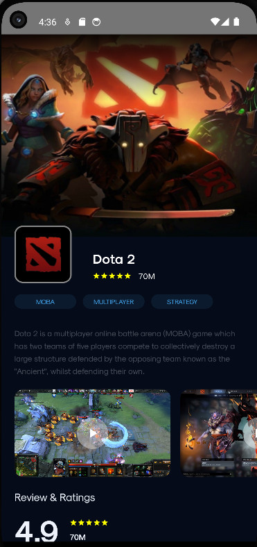
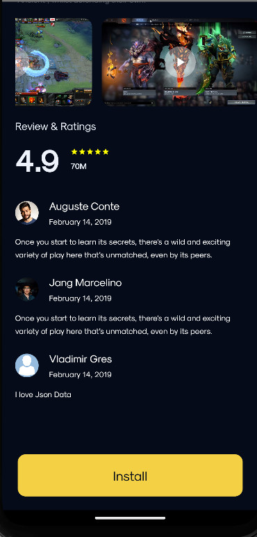

### Первая часть работы: Верстка.

В этой части задания, мы будем верстать при помощи Jetpack Compose.

#### О Верстке

Делалось все не за раз, поэтому по мере узнавания нового код под конец
улучшался(имхо), очень много чего есть улучшить и поэтому поводу есть
идеи, но хотелось сдать раньше(. Самое главное, что я только в самом
конце узнал о том как работать с Json, поэтому до этого были странные
решения в некоторых моментах.

#### Что можно улучшить

Много бойлер плейт кода. Например, некоторые элементы я пересоздавал,
для скорости, потому что не хотел их адаптировать, но в идеале так не
делать. Отображение картинок и видео, в зависимости от типа файла,
отображать сверх него кнопку плей или нет. Перевести всю поступаемую
информацию на Data Class.

Привести порядок в коде.

#### Что нравится
Очень мало хардкода, почти все элементы регулируются из вне. Все данные можно поменять.

Динамическое затемнение в хедере :).
#### Фотки

